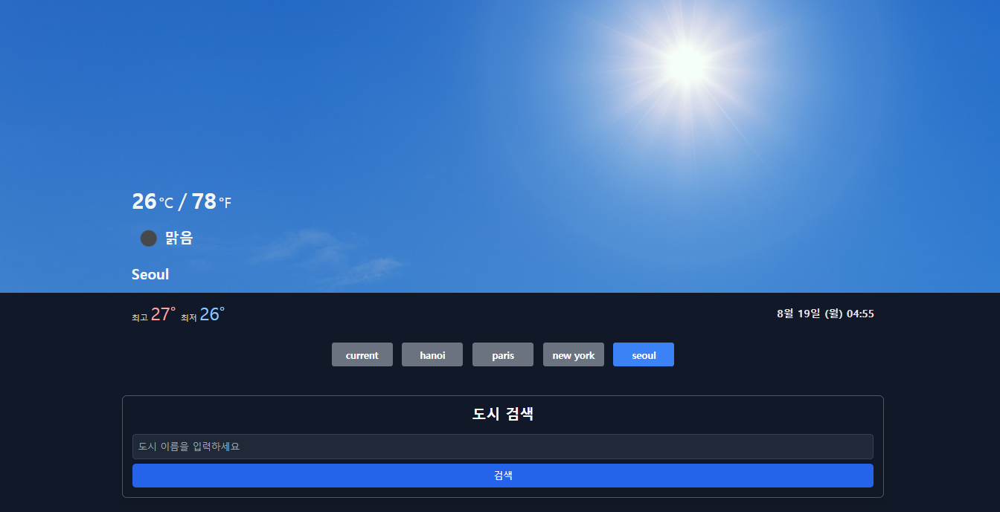

# 프로젝트 소개

웹 기반 날씨 정보 조회 애플리케이션입니다. 

사용자는 **현재 위치**를 자동으로 가져오거나, 특정 **도시를 검색**하여 해당 도시의 날씨 정보를 실시간으로 확인할 수 있습니다.

## 데모 페이지

[여기에서 애플리케이션을 확인해보세요!](https://sky-report-beryl.vercel.app/)

## 기능

- **현재 위치 가져오기**: 사용자의 현재 위치를 기반으로 자동으로 날씨 정보를 조회할 수 있습니다.
- **도시 검색**: 사용자가 도시에 대한 검색을 통해 원하는 도시의 날씨 정보를 조회할 수 있습니다.
- **현재 날씨 정보**: 검색한 도시 또는 현재 위치의 날씨 정보를 보여줍니다.
  - **체감 온도**: 현재 체감 온도
  - **강수량**: 최근 강수량
  - **구름 상태**: 현재 구름 상태
  - **풍속**: 바람의 속도
  - **기압**: 현재 기압
  - **습도**: 현재 습도
- **시간별 예보**: 검색한 도시의 시간별 날씨 예보를 제공하여, 사용자가 향후 날씨 변화를 쉽게 파악할 수 있습니다.

## 사용 기술

- **React**
- **Tailwind CSS**
- **Axios**
- **OpenWeatherMap API**
